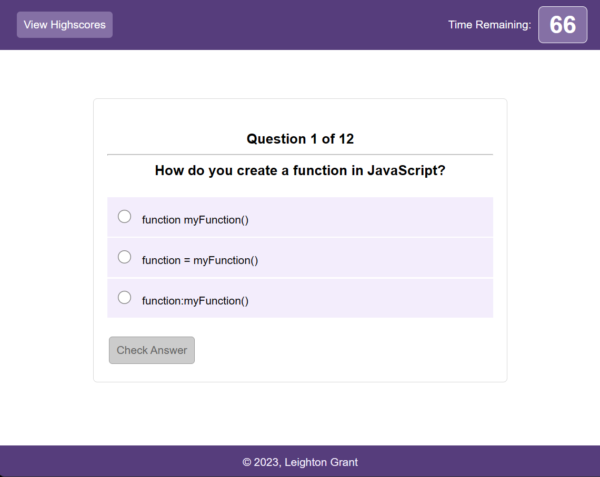

# About The Project

## A JavaScript Quip App

## Description

App Link: [(Open JavaScript Quiz)](https://misterouija.github.io/Javascript-Quiz/)

A Coding Quiz Challenge App that challenges the user to try to answer JavaScript code-related questions within the time limit. You get one point for each correct answer but keep in mind that incorrect answers will penalize your time by ten seconds!

(<a href="#readme-top">back to top</a>)

## Usage

Click "Start Quiz" button to start the challange and when finished enter your initials to save your score.

(<a href="#readme-top">back to top</a>)

## Built With

(<a href="#readme-top">back to top</a>)

## Installation

N/A

## Credits

N/A

## License

Please refer to the LICENSE in the repo.

(<a href="#readme-top">back to top</a>)
